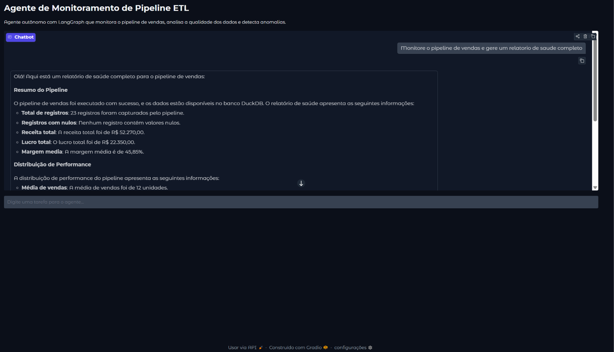
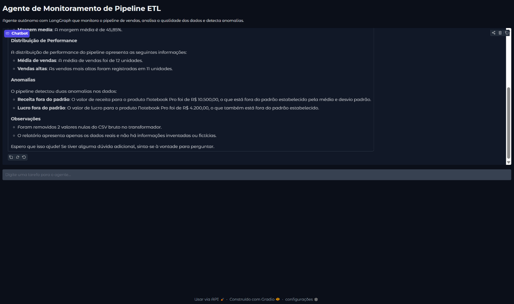

# `Agente de Monitoramento de Pipeline ETL`

> Agente autonomo com LangGraph e Ollama que monitora o pipeline de vendas, analisa qualidade dos dados e detecta anomalias - com interface web via Gradio.

---

## `Tecnologias`


---

## `O que faz`

Agente autonomo que recebe uma tarefa em linguagem natural, decide sozinho quais ferramentas usar e em que ordem, executa as analises e sintetiza um relatorio de saude do pipeline. Nao ha fluxo fixo - o LLM raciocina e age com base nos dados reais.

---

## `Arquitetura`

```
Tarefa (linguagem natural)
    LangGraph ReAct Agent (llama3.2 via Ollama)
        decide quais ferramentas chamar
            verificar_pipeline   - checa arquivos e timestamps
            analisar_dados       - le DuckDB e calcula metricas
            detectar_anomalias   - detecta outliers estatisticos (2 desvios padrao)
        sintetiza os resultados
    Resposta em linguagem natural
        Interface Gradio (http://localhost:7860)
```

---

## `Ferramentas do agente`

| Ferramenta | O que faz |
|---|---|
| `verificar_pipeline` | Verifica existencia e timestamp dos arquivos gerados pelo ETL |
| `analisar_dados` | Le o banco DuckDB e retorna metricas de qualidade e negocio |
| `detectar_anomalias` | Detecta outliers estatisticos com base em 2 desvios padrao |

---

## `Pre-requisitos`

- Python 3.10+
- Ollama instalado com `llama3.2` disponivel
- Pipeline [`etl_airflow`](https://github.com/Arthur-Baptista-dos-Santos/etl_airflow) executado ao menos uma vez

---

## `Instalacao`

```bash
git clone https://github.com/Arthur-Baptista-dos-Santos/agente_analise.git
cd agente_analise

python -m venv .venv
.venv\Scripts\activate

pip install -r requirements.txt
```

---

## `Como usar`

```bash
# Garanta que o Ollama esta rodando com o modelo disponivel
ollama pull llama3.2

# Suba o pipeline etl_airflow para gerar os dados
cd ../etl_airflow
docker compose up airflow-init
docker compose up webserver scheduler -d
# acesse http://localhost:8080, ative e dispare a DAG pipeline_vendas
docker compose down

# Rode o agente
cd ../agente_analise
python app.py
```

Acesse `http://127.0.0.1:7860` e interaja com o agente em linguagem natural.

---

## `Exemplos de uso`

- "Monitore o pipeline de vendas e gere um relatorio de saude completo"
- "Verifique se o pipeline ETL rodou corretamente hoje"
- "Analise a qualidade dos dados e detecte anomalias"
- "Qual vendedor tem a melhor performance? Analise os dados."

---

## `Estrutura`

```
agente_analise/
├── src/
│   ├── ferramentas.py   # 3 tools com @tool decorator (LangChain)
│   └── agente.py        # ReAct agent com LangGraph + system prompt
├── app.py               # interface Gradio com exemplos pre-definidos
├── relatorios/          # relatorios salvos (gitignored)
├── requirements.txt
├── .gitignore
└── README.md
```

---

## `Conceitos aplicados`

- **`Agente autonomo`**: loop de raciocinio ReAct (Reason + Act) sem fluxo fixo pre-definido
- **`LangGraph`**: framework para agentes com estado, grafo de execucao e loop de raciocinio controlado
- **`@tool decorator`**: transforma funcoes Python em ferramentas que o LLM pode chamar
- **`ReAct`**: padrao Reason+Act onde o agente raciocina, age, observa e raciocina de novo
- **`System prompt`**: instrucoes que forcam o agente a usar dados reais em vez de alucinar
- **`Ollama`**: inferencia local de LLMs sem custo de API, privacidade total dos dados
- **`Gradio`**: interface web de chat para demos de IA com exemplos interativos
- **`DuckDB`**: banco analitico embutido lido diretamente pelo agente como fonte de verdade

---

## `Demonstração`

**Agente respondendo em linguagem natural** — pergunta "Monitore o pipeline de vendas e gere um relatório de saúde completo". O agente decide sozinho quais ferramentas chamar, analisa o DuckDB e sintetiza o resultado.



---

**Detecção de anomalias e conclusão** — o agente identificou 2 anomalias (Notebook Pro com receita e lucro fora do padrão) e reportou os 2 registros nulos removidos pelo ETL.



---

## `Licença`

Distribuído sob a licença MIT. Veja [LICENSE](LICENSE) para mais informações.

---

## `Autor`

**Arthur Baptista dos Santos**
RM 565346 — Inteligência Artificial · FIAP 2025–2026

[](https://linkedin.com/in/arthur-baptista-dos-santos)
[](https://github.com/Arthur-Baptista-dos-Santos)
